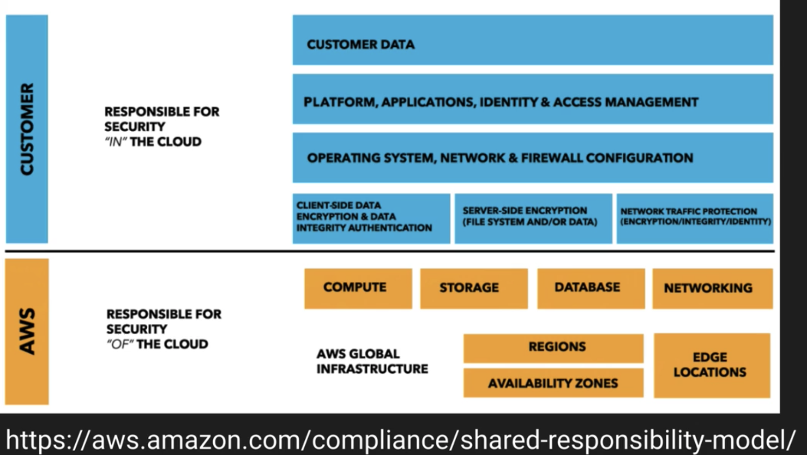

# AWS Security

- [AWS Security](#aws-security)
  - [Physical and environmental security](#physical-and-environmental-security)
  - [Business continuity management](#business-continuity-management)
  - [Network security](#network-security)
  - [AWS access](#aws-access)
  - [Secure design principles](#secure-design-principles)
  - [Change management](#change-management)
  - [AWS compliance programs](#aws-compliance-programs)
  - [AWS shared responsibility model (security OF the cloud)](#aws-shared-responsibility-model-security-of-the-cloud)
  - [Security IN the cloud](#security-in-the-cloud)
    - [Cloud controls](#cloud-controls)

Whitepaper: https://docs.aws.amazon.com/whitepapers/latest/introduction-aws-security/introduction-aws-security.pdf#welcome

## Physical and environmental security
- Mutli AZ on a region
- Fire detection/suppression
- Power
- Climate / temperature
- Management, ex soldiers
- Storage device decommissioning

## Business continuity management
- Availability
- Incident response
- Executive reviews
- Communication

## Network security
- Secure network architecture
- Secure access point - TLS, segregation between corporate amazon.com and aws
- Transmission protection

## AWS access
- Account review and audit
- Background checks
- Credentials policy

## Secure design principles
- SDLC

## Change management
- Software
- Infrastructure

## AWS compliance programs
- ISO 27001
- PCI DSS
- HIPAA

## AWS shared responsibility model (security OF the cloud)
- AWS - security of the cloud
  - global infra
  - hardware. software, networking, facilities
  - managed services
- Customer - security in the cloud
  - Infrastructure as a service 
  - EC2, security groups, IAM. Updates and security patches
  - Configuration of AWS. Eg. firewall

Model changes depending on service types
- Infrastructure (EC2, EBS, VPC)
  - Compute services - EC2, EBS, Auto Scaling, VPC
  - EC2 - AMIs, OS, applications, data in transit, data at rest, data stores, creds, policies
  - **Customer** responsible for patching EC2
- Container (RDS, EMR, Elastic Beanstalk)
  - **Amazon** responsible for patching of OS, RDS
- Abstracted (S3, Glacier, DynamoDB, SQS, SES)
  - **Amazon** responsible for underlying service components or OS
  - customer responsible for policies

## Security IN the cloud
### Cloud controls
- Visibility
  - Assets visibility
  - AWS Config
- Auditability
  - AWS CloudTrail
  - Are we complying with regulations
- Controllability
  - AWS KMS (multi-tenant)
  - AWS CloudHSM (dedicated) - FIPS 140-2 compliance requirement
- Agility
  - Adapting to changes
  - AWS CloudFormation
  - AWS Elastic Beanstalk
- Automation
  - Repeatable, eg. setting up wordpress site
  - AWS OpsWorks
  - AWS CodeDeploy
- Scale
  - Everyone get the same AWS security foundations
- Other
  - AWS IAM - (users, policies)
  - AWS CloudWatch - (monitor metrics)
  - AWS Trusted Advisor - (security, budgets warnings)
